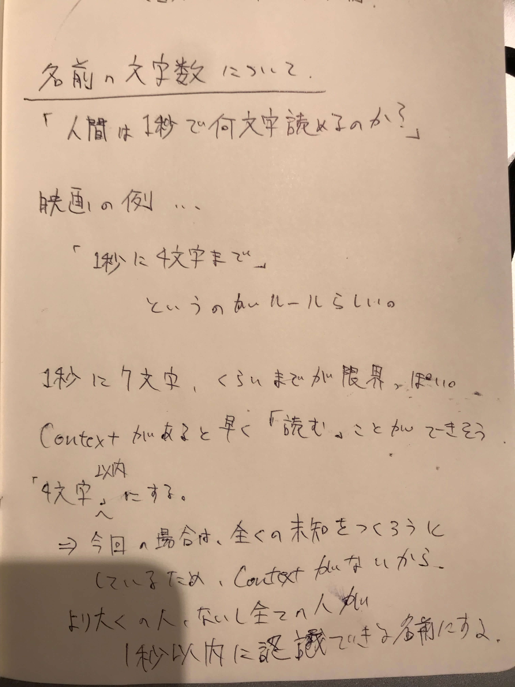

## 生成する「名前」の文字数について

## このプログラムに「名前をつける」。

### プロセスのログ

## 命名のプロセス

何回かプログラムを走らせてみる。

大体は読めない(=発音できない)。10回に一度くらい読める単語が生まれる。

発音できたとしても、強烈に意味の制約が加わる単語もある。

BYKO = "バイコ"

という単語が生まれた。

意外と単語の組み合わせからの意味の制約が強烈

- QRUW
- OIXE
- GMEN

## 発音できて、良さそうな単語リスト

- IGIA
- RYLC
- GALO
- MUYU
- THEI
- EBID
- GUET
- IINY

## TODO

- 選び方について
  - コントロールしないといけない項目
    - 発音による印象(=意味=目的)
  - そもそも読める=発音できるのか？
  - 恣意の生まれる選び方をすると、目的が生まれてしまうというジレンマ

## 選び方

### 指針
1. グローバルに認識することができる。
2. 未知の概念である。

### 基準
#### 1. 誰でも同じ発音ができる。
Indicator: 100人に発音してもらい、100人が同じ発音をすること。
#### 2. フラットな印象を与える。強い印象をできるだけ与えない。
Indicator: 100人に、その単語から受ける印象をきく。「分からない」「イメージできない」などの回答がX人以上。
